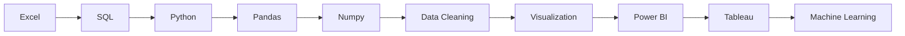

<!-- ===========================================================
     GitHub Profile README
     Username : Vishalravi-2007
     Save this as README.md
=========================================================== -->

<div align="center">

<!-- Animated Banner -->


<h1>

</h1>

</div>

---

#  About Me

<table>
<tr>
<td width="65%">

### 👨‍💻 Hello!

This is **Vishal**, a Computer Science student who is passionate about **Data Analytics**.

🚀 My goal is to become a **Data Analyst** and solve real-world problems using data.

### 🌟 Currently

- 📊 Learning **Power BI**
- 📈 Learning **Tableau**
- 🐍 Improving **Python**
- 🗄️ Practicing **SQL**
- 📑 Working with **Excel**
- 💼 Looking for **Data Analytics Internships**
- 📚 Exploring new technologies
- 🚀 Building Data Analytics Projects
- 💡 Learning something new every day

</td>

<td align="center">


</td>
</tr>
</table>

---

# 🚀 Tech Stack

<div align="center">

### Programming Languages


<br><br>

### Data Analytics


<br><br>

### Other Skills


</div>

---

# 📚 Currently Learning

<div align="center">

| Learning | Progress |
|----------|----------|
| 🐍 Python | ██████████░░ |
| 🗄 SQL | █████████░░░ |
| 📊 Power BI | ████████░░░░ |
| 📈 Tableau | ███████░░░░░ |
| 📑 Excel | ███████████░ |

</div>

---

# 🎯 Career Goal

```text
🎯 Become a Professional Data Analyst

✔ Python
✔ SQL
✔ Excel
✔ Power BI
✔ Tableau

➡ Build 50+ Data Analytics Projects
➡ Gain Internship Experience
➡ Learn Advanced Analytics
➡ Work with Real-world Data
➡ Keep Exploring New Technologies
```

---


# 📊 Data Analytics Roadmap



---

# 📊 Contribution Graph

<div align="center">


</div>

---

# 📌 Featured Technologies

<div align="center">


</div>

---

# 📊 Data Analytics Animation

<div align="center">


<br><br>


</div>

---

# 💻 Favorite Quote

<div align="center">

> ### "Without data, you're just another person with an opinion."

</div>

---

# 🌌 Visitor Counter

<div align="center">


<br><br>


</div>

---

<div align="center">


### ⭐ Thanks for visiting my GitHub Profile ⭐

### 🚀 Keep Learning • Keep Building • Keep Growing 🚀

</div>
